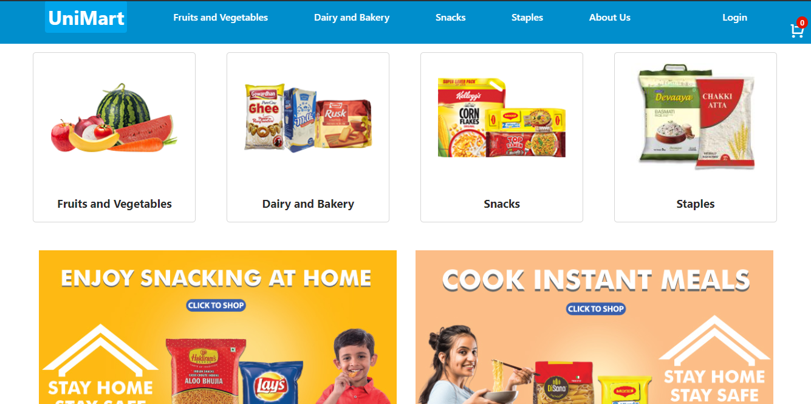
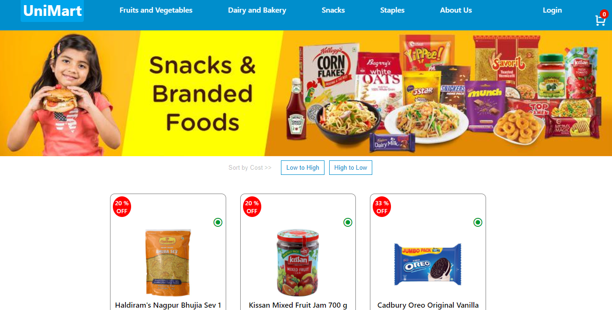
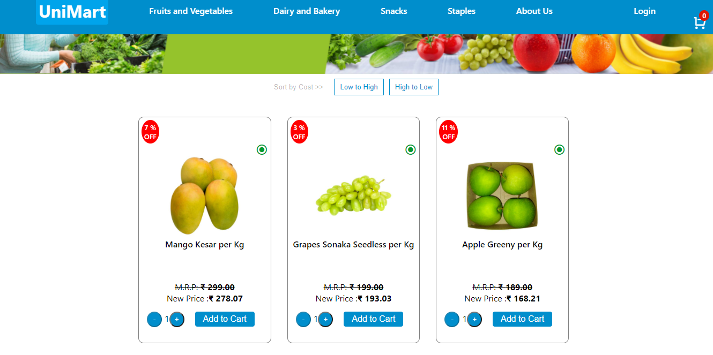
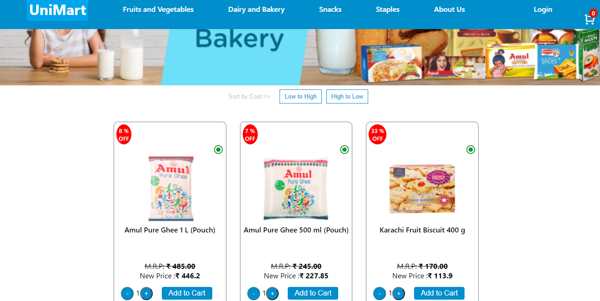
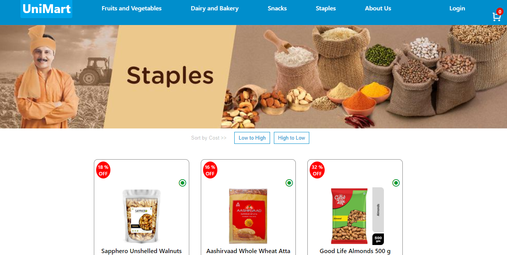
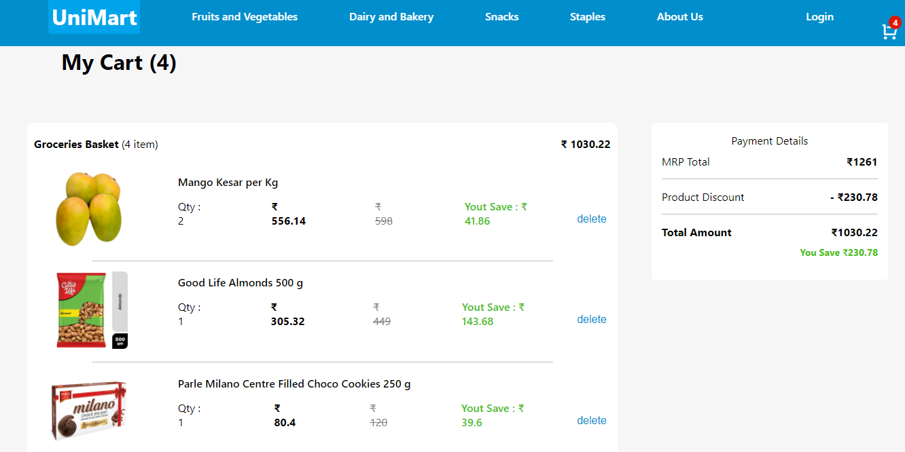

# Uni Mart (Cart App) 

  Simple cart app with all the basic features available on the JioMart website. User can add items to cart and remove from the cart.

## Link for the app

* https://unimart.netlify.app/

# Steps to install the project:

## Install basic Software:
* Install NodeJS
* Install VS Code
* Install Git

## Clone the following git repository inside any folder:

* https://github.com/info-vivekranjan/info-vivekranjan.github.io/tree/main/uni_mart

##  Open the cloned git repo in VS Code and install the required dependencies.

* #### Open a terminal and make sure you are in the working directory folder and run this command to install the required project dependencies in the main folder.
  * npm install   

* #### Now, Run npm start
* #### Now you can access the app at this URL: http://localhost:3000

## Technologies used
  
  * React
  * JavaScript
  * CSS
  * Libraries used
      
      * React-dom
      * react-scripts
      * React-router-dom
      * remix-icon
      * axios
      * react-alice-carousel
      * classnames
      

## Screenshots

* Landing Page

* Snacks Page

* Fruits & Vegs Page

* Dairy and Bakery Page

* Staples Page

* Cart Page

